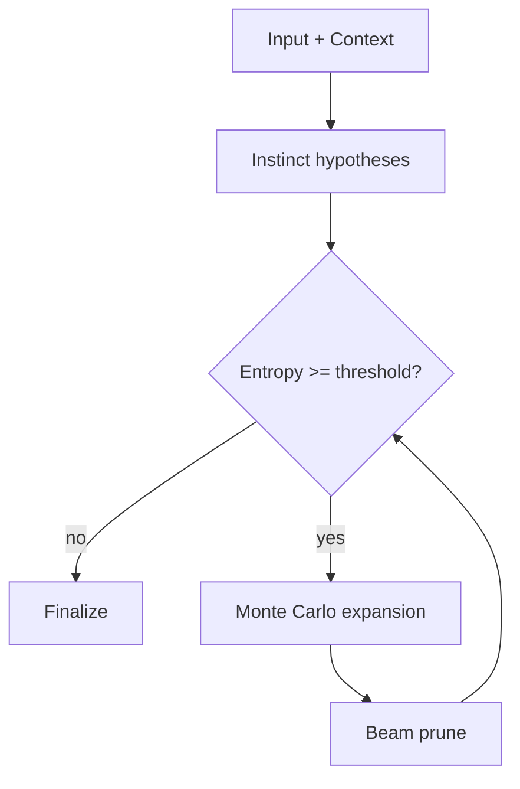

# Latent Reasoning

## 1. Overview
- Latent reasoning blends fast instinct-style hypothesis generation with iterative refinement.
- The agent keeps uncertainty explicit via entropy and asks clarifying questions when needed.

## 2. Architecture
1. Input + context
2. Initial hypotheses (instinct pass)
3. Entropy check
4. Optional expansion (Monte Carlo sampling)
5. Beam pruning at each depth
6. Final superpositional state

## 3. Configuration
- `clarify_entropy_threshold`: lower values reduce clarifying questions.
- `latent_max_depth`: increase for deeper iterative refinement.
- `beam_width`: number of hypotheses retained at each depth.
- `monte_carlo_samples`: enables expansion when non-zero.
- `latent_retry_attempts`, `latent_retry_min_wait`, `latent_retry_max_wait`, `latent_retry_multiplier`: backoff policy for latent LLM calls.

## 4. Troubleshooting
- Too many clarifying questions: lower `clarify_entropy_threshold`.
- No refinement: increase `latent_max_depth` and/or `monte_carlo_samples`.
